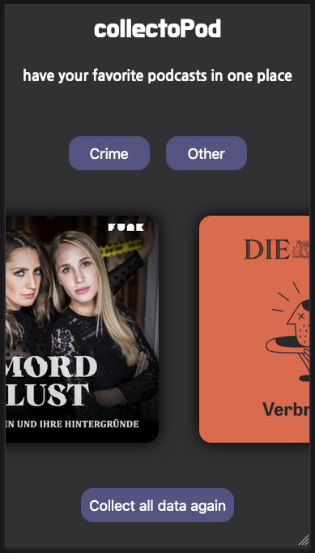
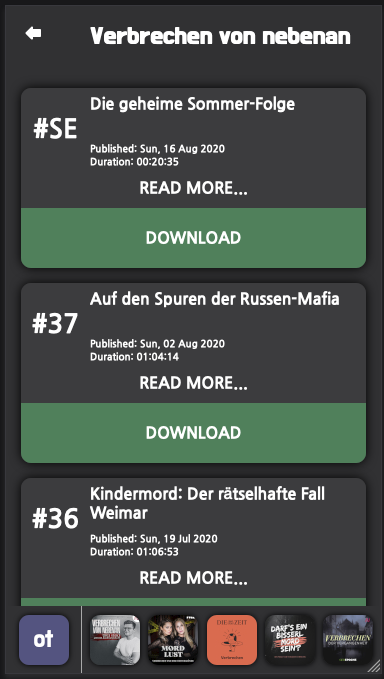

This project was bootstrapped with [Create React App](https://github.com/facebook/create-react-app).

# collectoPod

React app to handle all of my girlfriends favorite podcasts.

Crime podcasts are becoming increasingly popular in germany and the really well-known ones are often published on elaborate websites. So it is no longer possible to stop the podcast and listen to it later where you paused, because the players on the websites do not have the feature or if you close the website all progress are lost. And a download is not possible at all.

So collectoPod scraps rss feeds from my girlfriend's favorite podcasts and makes them available for download so that she can consume the episodes as simply as possible in her audio app of choice.

## install

- clone the repo
- navigate in root directory
- run `npm init`
- after the init is done
- run `npm run postinstall`

- check if you have installed python3 on your machine
- to do that, open your terminal or console and type `python3 --version` you should have at least python 3.7.3
- of not update or [install python on your machine](https://www.python.org/downloads/)
- install two python dependencies (requests and beautifulsoup):
- to do that, open your terminal or console and type `pip3 install requests`and after the installation is done type `pip3 install beautifulsoup4`

## Available Scripts

In the project directory, you can run:

### `npm start`

Runs the app in the development mode. 

- Open [http://localhost:3000](http://localhost:3000) to view it in the browser.
- Starts an express server on http://localhost:4000 where react fetches the data for the podcasts from.

The page will reload if you make edits. 

## Coding Progress

I`m still working on this project, so the app has some bugs I need to fix.
